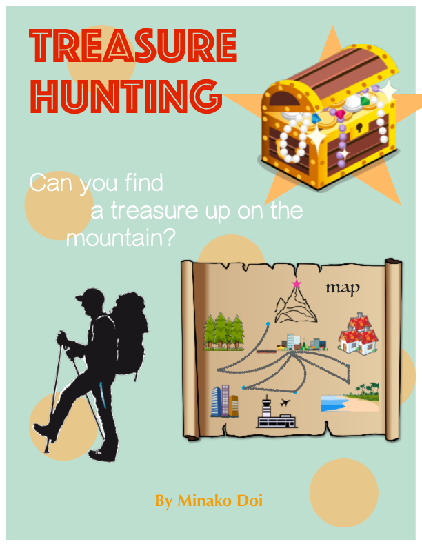

# ics-313-spring-2017-projects
The TA is too lazy to make an actual website for this

## The Witcher: Lost in Time 
### by Mark Arakaki


[Presentation]()

## Curseon
### by Adam Butac


[Presentation]()

## Cooking Quest
### by Lancen Daclinson


[Presentation]()

## Treasure Hunting
### by Minako Doi


[Presentation]()

## Sith
### by Glenn Galvizo


[Presentation]()

## Wizard's World DLC
### by Bryan Hahn


[Presentation]()

## Welcome to Mainstreet
### by Nicole Hanabusa


[Presentation]()

## Super Wizard Savior
### by Hendricks Hicks


[Presentation]()

## Escape the Basement!! 
### by Christopher Kim


[Presentation]()

## An Adventure on the High Seas
### by Anthony Kuloloia


[Presentation]()

## Raelin: The Trinity Jewels
### by Blake Larson


[Presentation]()

## The Wizard's Missing Orchestra
### by Vincent Luu


[Presentation]()

## Labyrinth Involving Stupid Puns
### by William Mullen
```
;;;;;;;;;;;;;;;;;;;;;;;;;;;;;;;;;;;;;;;;;;;;;;;;;;;;;;;;;;;;;;;;;;;;;;;;;;;;;
;
;	|
;	|
;	|	ABYRINTH	
;	|_____			
;	_______			
;	   |
;	   |
;	   |	NVOLVING
	___|___
;	 ______	
;	|
;	|_____
;	      |	TUPID
;	______|
;	______
;	|     |
;	|_____|
;	|	UNS
;	|
;
;		The neo-classic text-based adventure game.
;
;		One way in to the Labyrinth, 24-ish ways out.
;		Do you have what it takes?
;
;
;
;
;		All the frustration you remember from the 
;		early 90s, except on purpose!
;
;;;;;;;;;;;;;;;;;;;;;;;;;;;;;;;;;;;;;;;;;;;;;;;;;;;;;;;;;;;;;;;;;;;;;;;;;;;;
```

[Presentation]()

## Hacker Man
### by Clay Nakamura


[Presentation]()

## Locked Up Escape Room
### by Ah Lim Om


[Presentation]()

## Alphabetica
### by Samuel Park


[Presentation]()

## Defending the Castle
### by William Siu


[Presentation]()

## Hospital of Horrors
### by Jacky So


[Presentation]()

## Alien: Escape from LISP
### by Ryan Theriot


[Presentation]()

## Defeat the ASCII Cat
### by Kea Uehara


[Presentation]()

## Pursuit
### by Joshua Wadsack-Myers


[Presentation]()

## Cat Me If You Can
### by Xiao Yang


[Presentation]()

## Resident is Zombie
### by Yohan Yang


[Presentation]()

## The Mazes of Menace
### by Christopher Yeager


[Presentation]()